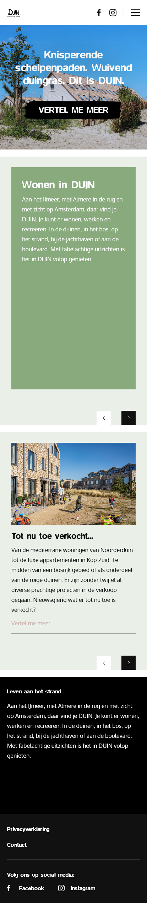
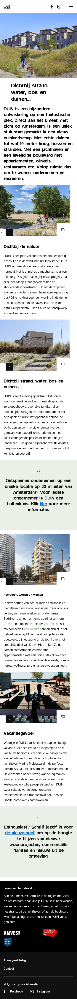
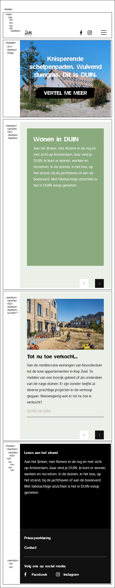
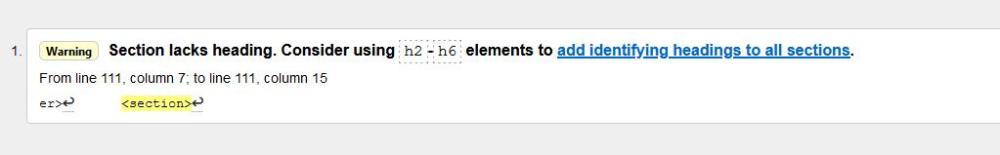
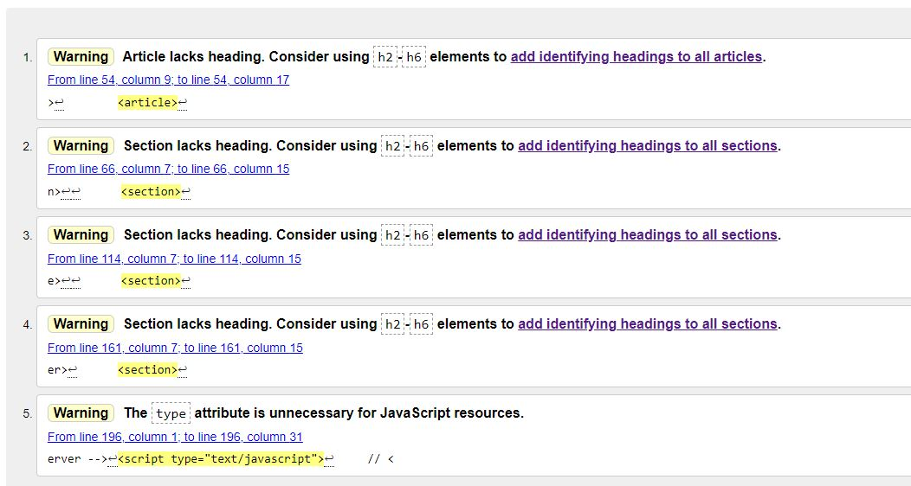
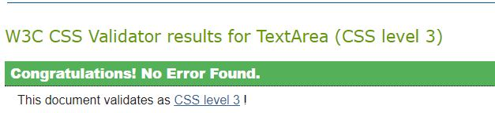
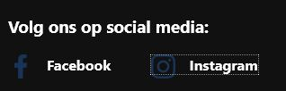
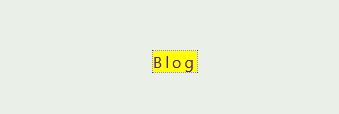
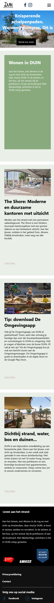
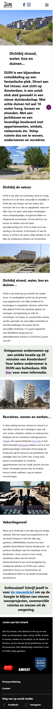

# Procesverslag
Markdown is een simpele manier om HTML te schrijven.  
Markdown cheat cheet: [Hulp bij het schrijven van Markdown](https://github.com/adam-p/markdown-here/wiki/Markdown-Cheatsheet).

Nb. De standaardstructuur en de spartaanse opmaak van de README.md zijn helemaal prima. Het gaat om de inhoud van je procesverslag. Besteedt de tijd voor pracht en praal aan je website.

Nb. Door *open* toe te voegen aan een *details* element kun je deze standaard open zetten. Fijn om dat steeds voor de relevante stuk(ken) te doen.

## Je website

uitwerken voor kick-off werkgroep

### Je opdracht:
https://duin.nl/

#### Screenshot(s) van de eerste pagina (small screen): 
Homepagina Duin
 

#### Screenshot(s) van de tweede pagina (small screen):
Over de wijk Duin
 

#### Breakdownschets mobile versie

 

## Toegankelijkheidstest

uitwerken na test

### Bevindingen
Lijst met je bevindingen die in de test naar voren kwamen:

#### HTML Validator

 

Met de Web Developer browser plugin heb ik de twee webpagina's door de HTML check gedaan. 
Hieruit bleek dus dat ik in de sections geen headings had gebruikt. Ik heb dat nu veranderd door 
headings toe te voegen maar om het niet in beeld te hebben maar wel accesible te maken voor screen readers,  
heb ik de headings een class gegeven en in CSS heb ik deze class een active en focus selector gegeven.

#### CSS Validator 

 

 

#### Tab navigatie 

Met de tab toets ben ik door de website heen gegaan. Ik kwam erachter dat ik helemaal geen `:focus` en `:active` 
selectors heb gebruikt.
 

 

 
Dit kan worden opgelost door de selectors `:focus` en `:active` te gebruiken in CSS. (geel als voorbeeld gebruikt, maar dit is geen goeie contrast-ratio!)
 
#### Alt attribuut check
 
Ik heb beide pagina's gecheckt op alternatieve tekst voor content images. Hier en daar miste er nog alternatieve tekst, die heb ik er meteen bij toegevoegd.

## Eindgesprek

uitwerken voor eindgesprek

### Stand van zaken

Als ik eenmaal bezig was lukte het wel, lastige was tijd ervoor nemen om eraan te werken. 
 Ik denk dat het lastige qua coderen, de footer was van de homepagina. Ik had hier en daar `height: xvh` gebruikt in een
 paar sections waardoor de `main` opeens heel klein werd. Maar het is uiteindelijk toch goed gekomen, ik heb het achterhaald door
 elk element te inspecteren.

### Screenshot(s)

 

## Bronnenlijst

continu bijhouden terwijl je werkt

Nb. Wees specifiek ('css-tricks' als bron is bijv. niet specifiek genoeg).

1. https://css-tricks.com/snippets/css/a-guide-to-flexbox/
2. https://www.youtube.com/watch?v=KcdBOoK3Pfw
3. https://www.youtube.com/watch?v=ee8y1IV6pOI
4. https://www.w3schools.com/tags/ref_pxtoemconversion.asp
5. https://chrispederick.com/work/web-developer/
6. https://www.educative.io/edpresso/how-to-add-a-line-break-using-css

